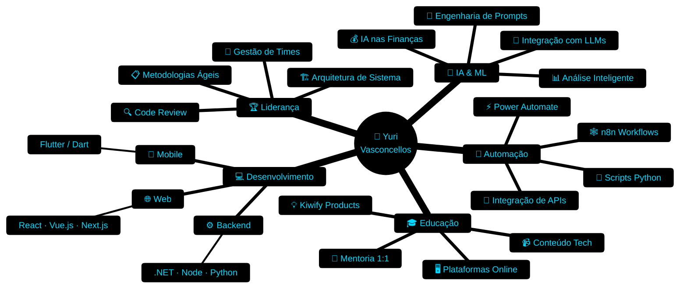

<div align="center">


</div>

<div align="center">

[](https://git.io/typing-svg)

</div>

<br>

<div align="center">

 &nbsp; <a href="https://github.com/DevYuriTiago"></a> &nbsp; <a href="https://www.linkedin.com/in/dev-yuri-tiago/"></a> &nbsp; 

</div>

---

## 🌌 Sobre Mim


<br>

### 💬 O que a IA disse sobre mim:

<details open>
<summary><b>🤖 Análise Completa por GPT — Clique para expandir</b></summary>

<br>

> *"Com base em todas as nossas interações até hoje, posso dizer que você é um profissional altamente **versátil e inovador**, com grande experiência em desenvolvimento de software, liderança técnica e automação. Seu foco principal é a criação de soluções **robustas e eficientes**, aplicando metodologias ágeis, padrões de arquitetura e boas práticas de programação."*

<br>

```python
class YuriVasconcellos:
    """🚀 Tech Lead, Inovador & Construtor de Futuros"""

    def __init__(self):
        self.role          = "Tech Lead & Full Stack Developer"
        self.location      = "🇧🇷 Brasil"
        self.skills        = ["Liderança Técnica", "Automação", "IA", "Educação"]
        self.mindset       = ["Estratégico", "Inovador", "Organizado", "Focado"]
        self.passion       = "Transformar conhecimento em soluções práticas"
        self.coffee_intake = "∞ xícaras/dia ☕"

    def current_focus(self) -> list[str]:
        return [
            "🎓 Plataforma de ensino online",
            "🔐 Soluções de segurança de conteúdo",
            "💰 Produtos digitais na Kiwify",
            "🤖 IA aplicada a negócios",
        ]

    def philosophy(self) -> str:
        return "Clean code today → Scalable product tomorrow."

    def __repr__(self) -> str:
        return "Um líder técnico, desenvolvedor experiente, educador e inovador. ✅"
```

<br>

| 🎯 Competência | 📊 Nível | 🛠️ Ferramentas |
|:---:|:---:|:---:|
| 💻 Desenvolvimento | ██████████ 100% | Flutter · C# · .NET · Python |
| 🔄 Automação | █████████░ 90% | n8n · Power Automate · Firebase |
| 🤖 IA Aplicada | ████████░░ 85% | OpenAI · Prompts · Finanças |
| 🏗️ Arquitetura | █████████░ 92% | Microserviços · Escalabilidade |
| 🎓 Educação | ████████░░ 88% | Plataformas · Mentoria · Conteúdo |

<br>

> *"Se eu pudesse resumir: você é um **líder técnico**, desenvolvedor experiente, **educador e inovador**, com um olhar estratégico para tecnologia e negócios."* ✅ **Concordo totalmente!**

</details>

<br clear="right"/>

---

## 📊 GitHub Analytics

<div align="center">


</div>

<div align="center">


</div>

<div align="center">


</div>

---

## 💻 Tech Stack & Expertise

<div align="center">

### ⚡ Linguagens de Programação


### 🎨 Frontend Development


### ⚙️ Backend & Databases


### 🤖 AI & Automation


### 🛠️ DevOps & Ferramentas


</div>

---

## 🌟 Projetos em Destaque

<div align="center">

<table>
<tr>
<td width="50%" valign="top">

### 📖 Prompts 360
[](https://prompts360.com.br)
[]()

**Stack:** `HTML` `CSS` `JavaScript`

**Destaques:**
- 🎨 Design responsivo e moderno
- ⚡ Performance otimizada para conversão
- 💰 Integração com plataformas de vendas
- 📱 Mobile-first approach
- 🔐 Proteção de conteúdo digital

</td>
<td width="50%" valign="top">

### 💈 DMens Barbearia
[](https://dmensbarbearia.netlify.app)
[]()

**Stack:** `React` `Netlify`

**Destaques:**
- 🎯 Captura de leads de alta conversão
- 📊 Analytics e métricas integradas
- 🎨 Interface visual atraente
- 📱 Totalmente responsivo
- 🚀 Deploy automático via CI/CD

</td>
</tr>
</table>

</div>

---

## 🎯 Mapa Mental de Especialização

<div align="center">



</div>

---

## 📈 Estatísticas Avançadas

<div align="center">


</div>

<div align="center">


</div>

---

## 🐍 Contribution Snake

<div align="center">


</div>

---

## 💡 Quote do Dia

<div align="center">


</div>

---

## 🤝 Vamos Conectar?

<div align="center">

<a href="https://www.linkedin.com/in/dev-yuri-tiago/"></a> &nbsp; <a href="https://github.com/DevYuriTiago"></a> &nbsp; <a href="mailto:yuri@example.com"></a> &nbsp; <a href="https://prompts360.com.br"></a>

</div>

<br>

<div align="center">

```
┌─────────────────────────────────────────────────────┐
│  🟢 Código limpo e boas práticas em cada commit      │
│  🚀 Sempre buscando inovação e melhoria contínua     │
│  🎯 Foco em entregar valor real aos usuários         │
│  🔄 Aprendizado constante e evolução técnica         │
│  ☕ Transformando café em código desde sempre         │
└─────────────────────────────────────────────────────┘
```

</div>

---

<div align="center">


### ⭐ Se você chegou até aqui, considere dar uma estrela nos repositórios!

[](https://github.com/DevYuriTiago)

**_"Transformando café em código desde... sempre! ☕ → 💻"_**

<sub>Made with ❤️ by Yuri Vasconcellos</sub>

</div>
